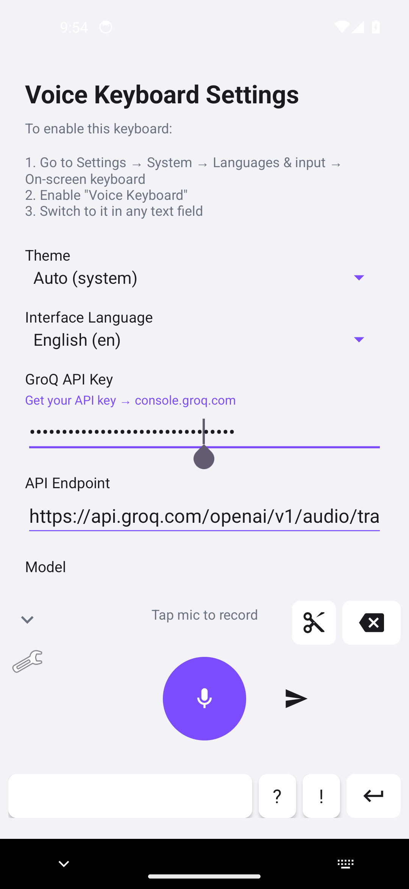
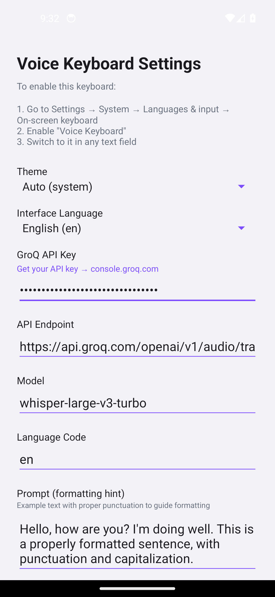
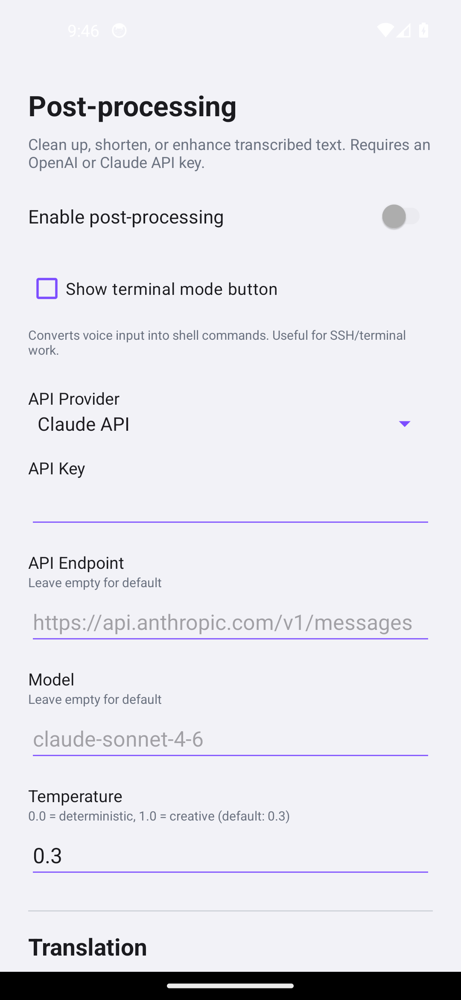
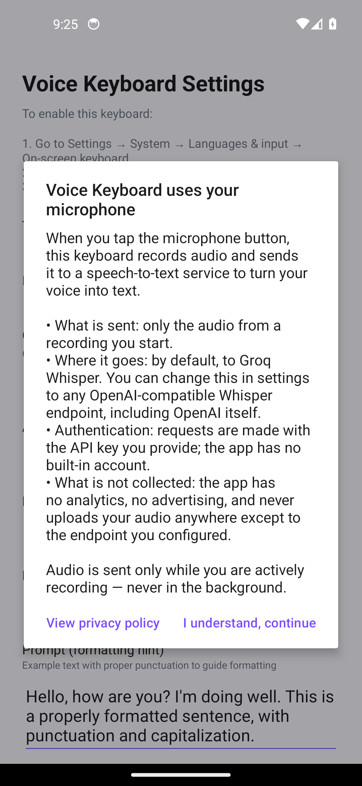

# Voice Keyboard

Android keyboard (IME) for speech-to-text. Sends audio to any OpenAI-compatible Whisper endpoint of your choice — by default Groq (free tier available), can be pointed at OpenAI or any other compatible provider. Optional LLM post-processing.

<p align="center">
  
  &nbsp;
  
  &nbsp;
  
</p>

## Features

### Voice Input
- Real-time voice recording with amplitude visualization
- **Processing queue** — start a new recording immediately, previous ones transcribe in the background
- Works with any OpenAI-compatible Whisper API; ships with Groq as the default endpoint (whisper-large-v3-turbo)
- Configurable API endpoint, model, and language
- Auto-start recording when keyboard opens

### Post-Processing
- **Fix errors** — corrects punctuation, spelling, removes filler words (um, uh)
- **Shorten** — makes text concise while keeping key points
- **Emoji** — adds relevant emoji to your messages
- **Rhyme** — rewrites dictated text as poetry
- **Translate** — translates to any of the supported languages
- Supports OpenAI and Claude as processing providers
- Customizable prompts and temperature for each mode

### Keyboard
- **Send button** (paper plane) — sends Ctrl+Enter for quick message sending in messengers
- **Accelerating backspace** — hold to delete slowly at first, then faster
- **Clipboard bar** stays visible after paste for repeated pasting
- **Graceful shutdown** — if keyboard hides during recording, audio is finalized and transcribed to clipboard

### General
- 17 interface and transcription languages
- Light, Dark, and Auto themes
- Long-press spacebar to switch keyboard
- Built-in test recording in settings
- App logs and crash reports
- Auto-update from GitHub Releases

## Setup

1. Install the APK from [Releases](https://github.com/rustemar/voice-keyboard/releases)
2. Go to Settings → System → Languages & input → On-screen keyboard
3. Enable "Voice Keyboard"
4. Open the app and enter a Whisper API key. The default endpoint is Groq — get a free key at [console.groq.com/keys](https://console.groq.com/keys). You can also point the app at OpenAI's Whisper endpoint or any other OpenAI-compatible provider in the same screen.
5. (Optional) Configure post-processing with your OpenAI or Claude API key

### Installing via Obtainium (recommended)

[Obtainium](https://github.com/ImranR98/Obtainium) is a third-party Android app that auto-updates apps directly from GitHub Releases. Recommended over the in-app updater if you want to avoid the system "install unknown apps" prompt and Play Protect warnings on each manual install.

1. Install Obtainium from its [releases page](https://github.com/ImranR98/Obtainium/releases) or via [F-Droid](https://apt.izzysoft.de/fdroid/index/apk/dev.imranr.obtainium.fdroid).
2. In Obtainium, tap **Add App** and paste `https://github.com/rustemar/voice-keyboard`.
3. Obtainium will install Voice Keyboard and notify you when new releases are published.

## Privacy

No analytics, no telemetry, no advertising. Audio is sent only to the transcription provider you configure, using your own API key. See [PRIVACY.md](PRIVACY.md) for the full policy.

Before first use of the microphone, the app shows a one-time disclosure explaining what is recorded, where it is sent, and what is **not** collected:

<p align="center">
  
</p>

## Building from source

```bash
git clone https://github.com/rustemar/voice-keyboard.git
cd voice-keyboard
./gradlew assembleDebug
```

## License

[MIT](LICENSE)
