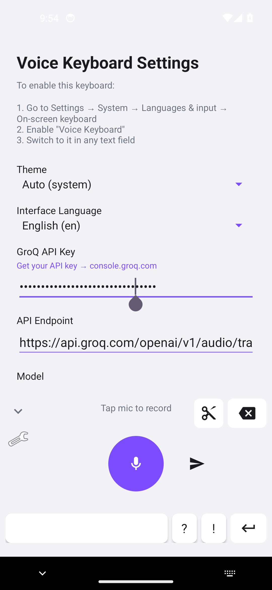
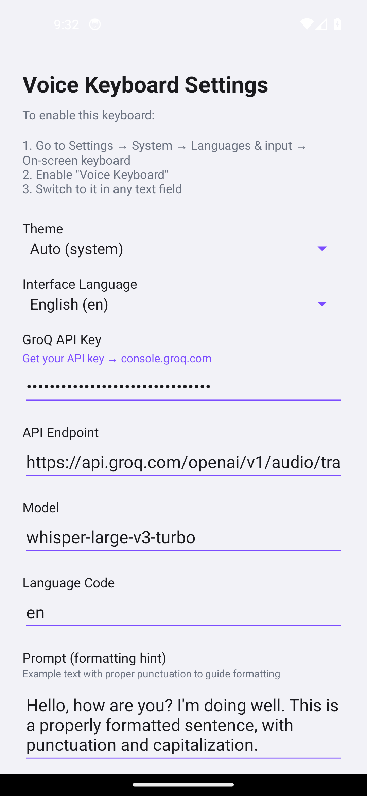
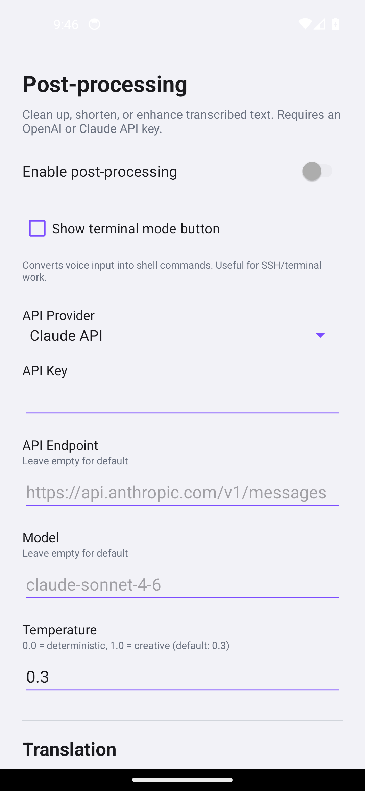
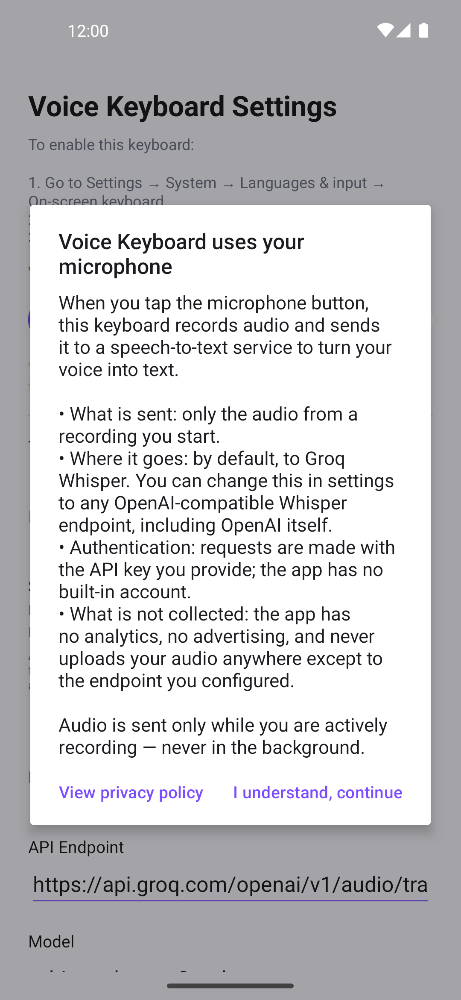

# Voice Keyboard

Android keyboard (IME) for speech-to-text. Sends audio to any OpenAI-compatible Whisper endpoint of your choice — by default Groq (free tier available), can be pointed at OpenAI, Mistral, or any other compatible provider. Optional LLM post-processing.

<p align="center">
  
  &nbsp;
  
  &nbsp;
  
</p>

## Features

### Voice Input
- Real-time voice recording with amplitude visualization
- **Processing queue** — start a new recording immediately, previous ones transcribe in the background
- **Offline-proof recovery** — recordings that can't be transcribed are saved on the device and resent automatically as soon as a validated internet connection returns; they survive closing the keyboard, app rebuilds, and reboots, and are kept until successfully sent (a "resend" button is also available to force a retry)
- Works with any OpenAI-compatible Whisper API; ships with Groq as the default endpoint (whisper-large-v3-turbo). Free keys are available from both Groq and Mistral
- Configurable API endpoint, model, and language
- **Multiple dictation languages** — list several language codes in settings and a language key appears on the keyboard: tap to cycle, long-press to pick one. The formatting prompt follows the language you switch to
- Auto-start recording when keyboard opens
- **Voice input for your other keyboard** — a keyboard with a mic key, such as HeliBoard, can open Voice Keyboard for dictation; with *Return to previous keyboard* on, your keyboard comes back as soon as the text is typed
- **Custom vocabulary** — add names and technical terms to bias recognition; helps with contacts and rare words
- **Drop period for single-word output** — handy for voice search where a trailing period gets in the way

### Post-Processing
- **Fix errors** — corrects punctuation, spelling, removes filler words (um, uh)
- **Shorten** — makes text concise while keeping key points
- **Emoji** — adds relevant emoji to your messages
- **Rhyme** — rewrites dictated text as poetry
- **Translate** — translates into any of the supported languages; the toggle shows the target, e.g. →EN
- Modes are switched with toggle buttons right on the keyboard, per recording; on Android 8 and newer, long-press a button to see what it does
- Works with OpenAI, Claude, or any OpenAI-compatible provider (OpenRouter, Groq, …)
- Customizable prompts and temperature for each mode
- Reasoning models work too: their `<think>` blocks are stripped before the text is inserted, and models that reject a custom temperature are retried without it
- Provider presets (OpenAI, Claude, OpenRouter, Groq, Mistral, DeepSeek) fill in the endpoint and a model that exists there

### Keyboard
- **Send button** (paper plane) — sends Ctrl+Enter for quick message sending in messengers
- **Accelerating backspace** — hold to delete slowly at first, then faster
- **Punctuation keys** — `.`, `?` and `!` next to the space bar for when dictation gets the punctuation wrong; they swallow the space left by dictation, so "hello " + `.` reads "hello."
- **Smart spacing** — dictated text gets a space in front when the cursor sits after a word, and never a doubled one before an existing space or full stop
- **Clipboard bar** stays visible after paste for repeated pasting
- **Graceful shutdown** — if keyboard hides during recording, audio is finalized and transcribed to clipboard

### General
- 17 interface and transcription languages
- Light, Dark, and Auto themes
- Long-press spacebar to switch keyboard
- Built-in test recording in settings
- App logs and crash reports, saved to a file or shared straight from settings
- Optional update check from GitHub Releases (off by default; the app asks once and the switch is in settings)
- Recordings that failed permanently can be resent or deleted from the keyboard (hold the resend key twice)

## Setup

1. Install the APK from [Releases](https://github.com/rustemar/voice-keyboard/releases)
2. Open the app and tap **Enable keyboard** (or go to Settings → System → Languages & input → On-screen keyboard)
3. Enable "Voice Keyboard"; the app shows whether it is enabled and which keyboard is active
4. Enter a speech-to-text API key. Any OpenAI-compatible Whisper endpoint works:
   - **Groq** (default, free) — get a key at [console.groq.com/keys](https://console.groq.com/keys); nothing else to change.
   - **Mistral** (free) — get a key at [console.mistral.ai](https://console.mistral.ai/api-keys), then pick *Mistral* in the provider preset list (or set the endpoint to `https://api.mistral.ai/v1/audio/transcriptions` and the model to `voxtral-mini-latest`).
   - **OpenAI** or any other compatible provider — pick the preset, or set the endpoint and model in the same screen.
5. (Optional) Configure post-processing with an OpenAI or Claude API key, or any OpenAI-compatible provider:
   - **OpenRouter** — provider "OpenAI-compatible", endpoint `https://openrouter.ai/api/v1` (the rest of the path is added automatically), model with the vendor prefix, e.g. `openai/gpt-4o-mini`. The translation model can stay empty; it reuses the model you set.
   - Once post-processing is enabled, a row of toggle buttons (fix, shorten, emoji, rhyme, translate) appears on the keyboard above the space bar.

### Using it with another keyboard

Voice Keyboard has no letter keys. To type by hand as well, keep your usual keyboard and let its mic key open Voice Keyboard:

1. Enable Voice Keyboard in the system keyboard list (step 3 above); you don't have to switch to it.
2. In your keyboard, turn on the voice input key (in HeliBoard it sits in the toolbar).
3. In Voice Keyboard settings, turn on **Return to previous keyboard**, and **Auto-start recording** if the mic key should start recording right away.

The mic key now opens Voice Keyboard, and once your text is typed your keyboard comes back by itself; the key in the top corner of the panel takes you back too. Voice Keyboard stays open while there is still something to see: a recording being transcribed, an error, or a recording waiting to be resent. If the mic key opens Google voice typing instead, switch Google voice typing off in the system keyboard list. Gboard and Samsung Keyboard use their own voice input.

### Installing via Obtainium (recommended)

[Obtainium](https://github.com/ImranR98/Obtainium) is a third-party Android app that auto-updates apps directly from GitHub Releases. Recommended over the in-app update check if you want to avoid the system "install unknown apps" prompt and Play Protect warnings on each manual install.

1. Install Obtainium from its [releases page](https://github.com/ImranR98/Obtainium/releases) or via [F-Droid](https://apt.izzysoft.de/fdroid/index/apk/dev.imranr.obtainium.fdroid).
2. In Obtainium, tap **Add App** and paste `https://github.com/rustemar/voice-keyboard`.
3. Obtainium will install Voice Keyboard and notify you when new releases are published.

## Troubleshooting

- **The keyboard is not in the list** — tap *Enable keyboard* in the app; it opens the system screen where "Voice Keyboard" has to be switched on.
- **I can't type my API key** — while Voice Keyboard is the active keyboard its panel has no letter keys. The settings screen says so and offers *Switch keyboard*; long-pressing the space bar on the keyboard does the same. To type by hand and still dictate, see *Using it with another keyboard*.
- **"Microphone permission required"** — tap the mic again and the system prompt appears. After "Don't ask again" the app opens its settings page instead; allow the microphone there.
- **Apply says "Not found"** — the provider's own message in brackets tells whether the address or the model name is wrong. A retired model looks the same as a wrong URL without it.
- **A red counter under backspace** — recordings that could not be transcribed yet. Ones waiting for internet resend themselves; tap to resend after fixing a key; hold twice to delete all of them.
- **Text arrives without a space, or with a stray one** — spacing follows the character next to the cursor; a field that hides its text from keyboards falls back to the configured trailing space.

## Privacy

No analytics, no telemetry, no advertising. Audio is sent only to the transcription provider you configure, using your own API key. See [PRIVACY.md](PRIVACY.md) for the full policy.

Before first use of the microphone, the app shows a one-time disclosure explaining what is recorded, where it is sent, and what is **not** collected:

<p align="center">
  
</p>

## Building from source

```bash
git clone https://github.com/rustemar/voice-keyboard.git
cd voice-keyboard
./gradlew assembleDebug
```

## License

[MIT](LICENSE)
